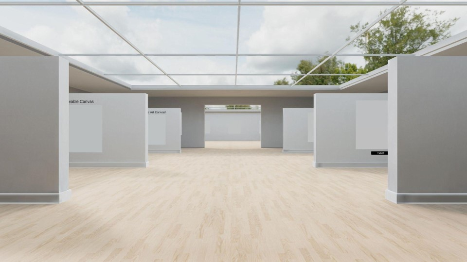
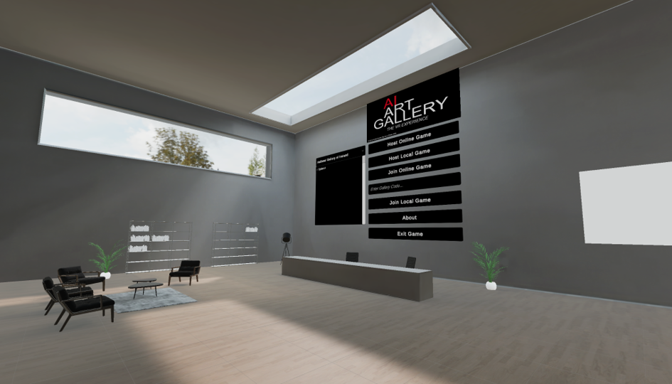
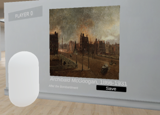
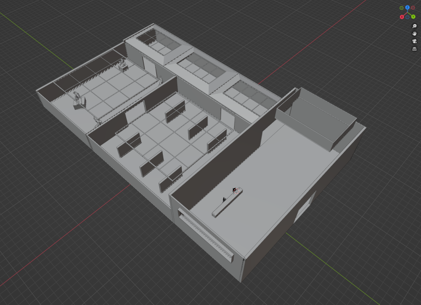
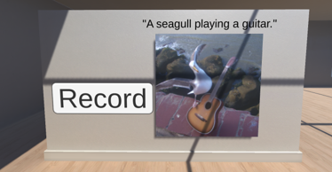
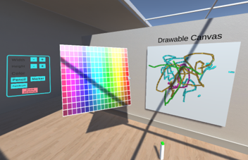

# VR AI Art Gallery
The full version of this project can be found [here](https://gitlab.scss.tcd.ie/software-engineering-group-10/vr-art-gallery).

</img>

This project was created for a Software Engineering module as part of the Virtual and Augmented Reality Masters Program. It was a group project with 8 team members, that focused on the software development process and using core programming proinciples within the agile development framework, to develop a software program in a well organised manner.

We set ourselves the objective of creating a VR Art Gallery application, with various features such as multiplayer, AI art generation and painting on canvases.

We used Gitlab for version control as it was less restrictive with large file sizes. The link to the repository can be found [here](https://gitlab.scss.tcd.ie/software-engineering-group-10/vr-art-gallery). This repository just has the final application available for download in the release secton.

The project spanned about 3 months and was developed in Unity. All the functionality was created by our team and the map and some of the 3D assets were also created by our team.

---

## Game Features

- Multiplayer Art Galleries using Unity Gaming Services
- Features Various Art Galleries from Dublin City
- Interactive Art Descriptions below each artwork.
- VR and Mouse and Keyboard Desktop app versions.

</img></img>

---

## My Responsibilities:
- 3D Modelling Map and Game Objects
- Programming the Multiplayer Functionality
- Setting up the OpenAI integration
- Designing and Implementing Menu Functionality
- Setting up Basic Drawing Functionality

</img>
</img>
</img>

